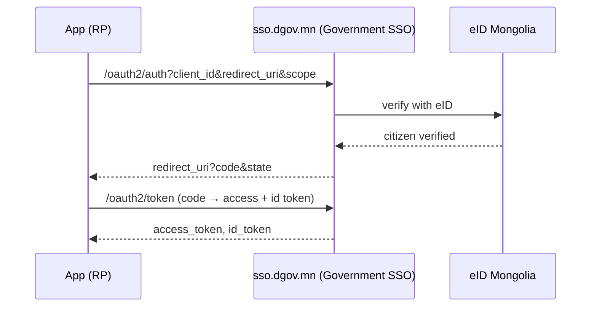

# Authentication (eID + Government SSO)

The platform supports:

- **eID sign-in** — with the electronic ID (QR / App2App / national-ID push).
- **Google linking** — link a Google account after an eID verification.
- **Government SSO (OIDC)** — the platform itself acts as an OpenID Connect
  provider; apps sign in through it.

## eID sign-in

Push straight to the eID app (App2App) or scan a QR code. Sessions are JWT
access + refresh (rotation); logout revokes both (refresh + access deny-list).
There is no password or email/OTP login.

The `sub` (subject) is the platform's **stable, opaque per-citizen identifier**
(user UUID), passed to the built-in OIDC provider in the flow.

## Government SSO (OIDC provider)

The platform is an OpenID Connect provider built on its **own Go code**. Relying-party
(RP) apps delegate sign-in to the platform and receive verified user data as
standard claims.

!!! tip "SSO is a built-in (base) service"
    SSO sign-in is served to **every registered app** automatically via the base
    OIDC scopes (`openid profile email`). Login is not granted or blocked per app.
    **Add-on** services (like the eID proxy) do require per-app authorization —
    see [eID Service Proxy](eid-services.md).

To connect your app as an RP, see [App integration](sso-integration.md).
