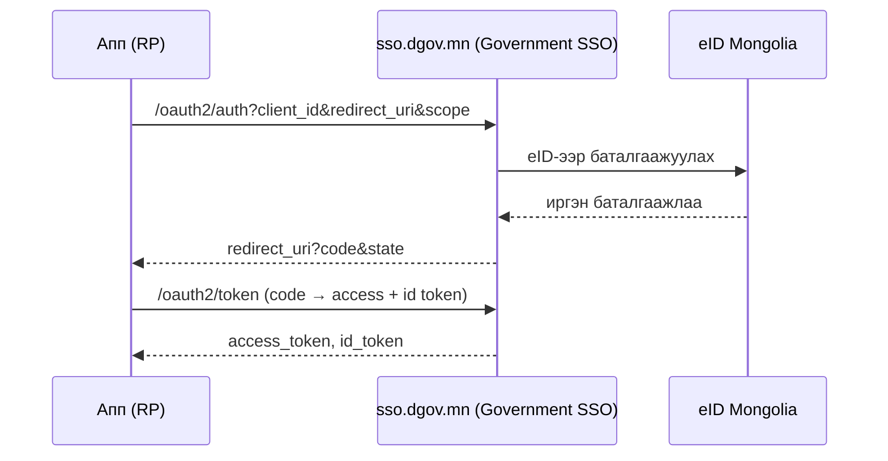

# Нэвтрэлт (eID + Government SSO)

Платформ дараах нэвтрэлтийг дэмжинэ:

- **eID нэвтрэлт** — цахим үнэмлэхээр (QR / App2App / РД push).
- **Google холболт** — eID баталгаажуулалтын дараа Google дансаа холбоно.
- **Government SSO (OIDC)** — платформ өөрөө OpenID Connect провайдер болж, апп-ууд
  түүгээр дамжин нэвтэрнэ.

## eID нэвтрэлт

Цахим үнэмлэхийн апп руу шууд мэдэгдэл (App2App) илгээх, эсвэл QR код уншуулна.
Session нь JWT access + refresh (rotation); logout хоёуланг хүчингүй болгоно
(refresh + access deny-list). Нууц үг / и-мэйл-OTP нэвтрэлт байхгүй.

`sub` (subject) нь платформын **тогтвортой, opaque per-citizen танигч** (user UUID)
бөгөөд OIDC провайдер урсгалд өөрийн провайдер цөмд дамждаг.

## Government SSO (OIDC провайдер)

Платформ нь **өөрийн Go код** дээр суурилсан OpenID Connect провайдер. Relying party
(RP) апп-ууд нэвтрэлтээ платформд даатган, хэрэглэгчийн баталгаажсан мэдээллийг
стандарт claim-аар авна.

!!! tip "SSO бол суурь (built-in) үйлчилгээ"
    SSO нэвтрэлт нь **бүх бүртгэгдсэн апп**-д base OIDC scope (`openid profile
    email`)-оор автоматаар үйлчилнэ. Нэвтрэлтийг per-app checkbox-оор олгодоггүй,
    хаадаггүй. Харин **нэмэлт** service-үүд (eID proxy гэх мэт) нь per-app
    зөвшөөрөл шаарддаг — [eID Service Proxy](eid-services.md)-г үз.

Апп-аа RP болгож холбохыг [Апп холбох](sso-integration.md)-оос үзнэ үү.
